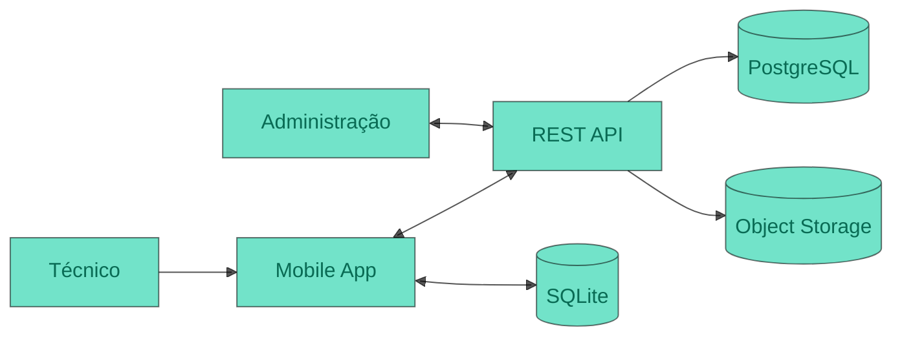
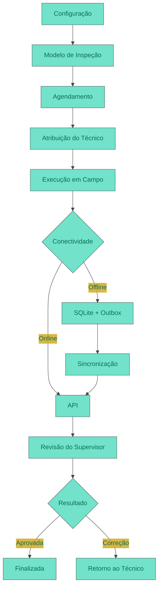
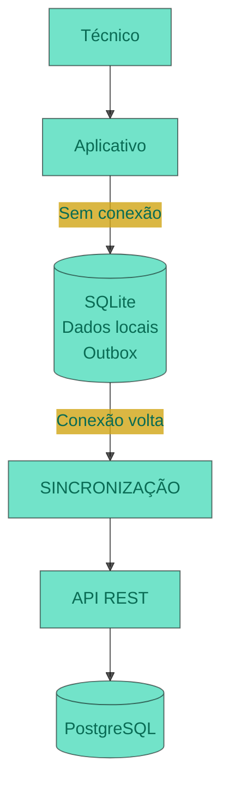
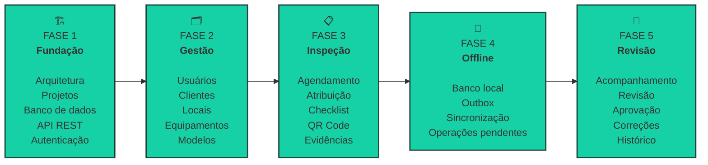

<h1 align="center" style="color: #17D1A6">FieldOps</h1>
<h2 align="center" style="color: #000000b2">Plataforma de Inspeção em Campo</h2>

  <strong>Planeje. Execute. Registre. Revise.</strong> 

       

<h2 style="color: #17D1A6">Visão Geral</h2>

O **FieldOps** é uma plataforma digital desenvolvida para organizações que realizam **inspeções técnicas em campo**, conectando a operação realizada pelos técnicos à gestão administrativa em um único fluxo.
A plataforma substitui processos fragmentados — como **formulários impressos, planilhas, mensagens e registros informais** — por uma solução digital integrada, padronizada e rastreável.

<h3 style="color: #17D1A6">Do Campo  à Gestão</h2>

|  Operação em campo 📱        |  Gestão administrativa 🖥️     |
| :--------------------------- | :----------------------------- |
| Receber inspeções atribuídas | Configurar modelos de inspeção |
| Identificar equipamentos     | Agendar atividades             |
| Executar checklists          | Atribuir técnicos              |
| Registrar evidências         | Acompanhar execuções           |
| Registrar não conformidades  | Analisar resultados            |
| Trabalhar offline            | Revisar e aprovar inspeções    |

<h3 style="color: #17D1A6">Um único fluxo</h2>

O FieldOps permite que o técnico execute suas atividades mesmo em locais **sem conexão com a internet**, registrando checklists, evidências e informações da inspeção para posterior sincronização.
Ao mesmo tempo, administradores e supervisores acompanham o processo, desde a configuração e planejamento até a revisão dos resultados.

> **FieldOps conecta a operação em campo à gestão, preservando evidências, histórico, localização e regras de negócio em um único fluxo.**

<h3  align="center" style="color: #17D1A6">Resultado</h2>

**Uma operação de inspeção mais padronizada, rastreável e conectada**.

 
<h2 style="color: #17D1A6">Principais recursos</h2>

- [ ] Segurança
- [ ] Mobile
- [ ] Checklists 
- [ ] Evidências
- [ ] Offline
- [ ] Sincronização 

<h2  style="color: #17D1A6">Arquitetura</h2>

<h2 style="color: #17D1A6">Fluxo principal</h2>

O fluxo de uma inspeção no FieldOps é baseado em um ciclo completo:

<h2  align="center" style="color: #17D1A6">Offline-first architecture</h2>

Um dos principais diferenciais do FieldOps é a capacidade de executar inspeções **mesmo sem conexão com a internet**.
Durante uma inspeção, o técnico poderá continuar trabalhando normalmente.
Os dados serão armazenados localmente e posteriormente enviados para a API quando a conexão estiver disponível.

<h2 style="color: #17D1A6">Segurança / rastreabilidade</h2>

No FieldOps, segurança e rastreabilidade fazem parte do processo de inspeção desde a execução em campo até a revisão dos resultados.
Cada operação deve estar associada ao usuário responsável, às permissões correspondentes, às evidências registradas e ao histórico da atividade, garantindo maior controle sobre os dados e sobre o ciclo de vida de uma inspeção.

<h3 style="color: #17D1A6">Camadas de controle</h3>

| Controle | Objetivo |
|---|---|
| **Autenticação** | Identificar e validar os usuários da plataforma |
| **Perfis e permissões** | Controlar o acesso conforme o papel do usuário |
| **Autorização** | Garantir que cada operação respeite as permissões definidas |
| **Versionamento** | Preservar a versão do modelo utilizada na inspeção |
| **Evidências** | Associar fotos e arquivos às informações registradas |
| **Localização** | Registrar a localização relacionada à execução |
| **Histórico** | Preservar alterações e eventos relevantes |
| **Auditoria** | Permitir o rastreamento das operações realizadas |
| **Sincronização** | Registrar e controlar a transferência dos dados entre dispositivo e servidor |

<h2 align="center"  style="color: #000000b2">Escopo do MVP</h2>

O MVP será capaz de demonstrar o fluxo completo de uma inspeção:

### Administrador

* [ ] Cadastrar dados básicos
* [ ] Gerenciar usuários
* [ ] Cadastrar clientes
* [ ] Cadastrar locais
* [ ] Cadastrar equipamentos

ADMIN
█░ 0%

### Supervisor

* [ ] Criar modelo de inspeção
* [ ] Versionar modelo
* [ ] Agendar inspeção
* [ ] Atribuir técnico
* [ ] Acompanhar execução
* [ ] Revisar resultado
* [ ] Aprovar inspeção
* [ ] Reprovar ou solicitar correção

SUPERVISOR
█░ 0%

### Técnico

* [ ] Autenticar no aplicativo
* [ ] Consultar inspeções atribuídas
* [ ] Identificar equipamento via QR Code
* [ ] Executar checklist
* [ ] Registrar respostas
* [ ] Registrar observações
* [ ] Registrar não conformidades
* [ ] Capturar fotografias
* [ ] Capturar localização
* [ ] Trabalhar offline
* [ ] Sincronizar dados

TÉCNICO
█░ 0%

<h2 align="center" style="color: #17D1A6">Roadmap</h2>

## 📄 Documentação

A documentação técnica do projeto está disponível no diretório:

[/docs](link)

Documentações específicas sobre arquitetura, API, banco de dados, sincronização e regras de negócio serão adicionadas conforme a evolução do projeto.

<h2 style="color: #17D1A6">Equipe</h2>
 

Kelvim Lucas

Ryan Augusto

Gustavo  Senna

Carlos Eduardo

Gustavo Silveira

<footer align="center">
  <strong style="color: #17D1A6">FieldOps</strong> 
  Inspeções em campo. Dados que geram confiança.
</footer>
